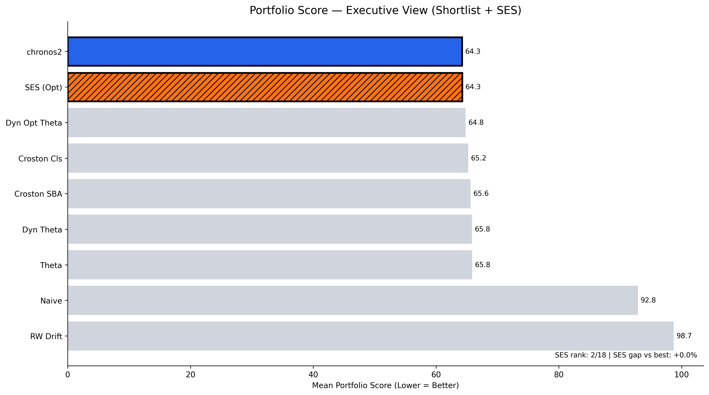
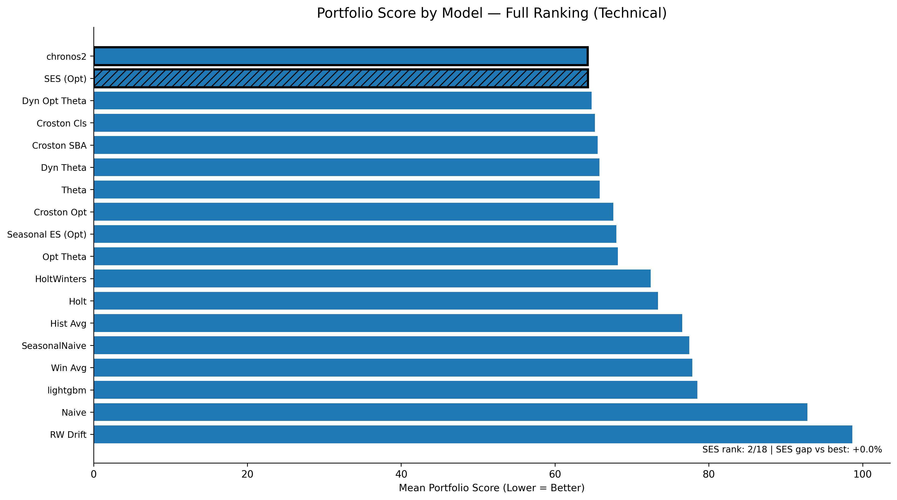

# Simple Models Win Where It Matters: Example SES

AI is advancing at incredible speed. It is tempting to assume that advanced models lead to better outcomes. This assumption often fails in demand forecasting. The best model in operations isn't the smartest one. It's the one that stays competitive while remaining stable, explainable, and governable at portfolio scale. The score difference between simple and complex can be minute. The operational difference is huge.

Let us take the case of univariate models — they lack demand drivers (ML features) like price, location, promotions, weather, marketing pushes, etc. It is easy to assume that such models will not perform well. One would be pleasantly surprised by how good they actually perform without any bells and whistles.

When transitioning from a manual forecasting process to AI-assisted planning, it is useful to leverage such models, as they work on just the past data for each SKU. Thereby, get the system running while one transitions to driver-driven ML models. And in practice, at the start, driver data is rarely ready: unclean, messy, or too unreliable to operationalize.

In demand forecasting, modern portfolios have hundreds or thousands of SKUs, each behaving somewhat differently — which is exactly where univariate models remain competitive.

## Benchmark setup

I benchmarked 18 univariate forecasting models on a 297-SKU subset from FreshRetailNet-50K (daily, intermittent demand, perishable context).

Dataset: <https://huggingface.co/datasets/Dingdong-Inc/FreshRetailNet-50K/tree/main>

The benchmark included:

- **Classical methods:** SES, Holt, Holt-Winters, Theta, Croston variants, Naïve  
- **ML model (univariate formulation):** LightGBM  
- **Foundation model:** Chronos2  

## Result

In the top plot, one can clearly see one such model — **Simple Exponential Smoothing Optimized (SES)** with a score of **64.28** — sitting very close to the top-performing model **Chronos2 (64.25)**. Lower score is considered better. SES (Optimized) is effectively tied with the best portfolio model, Chronos2. Here, the score difference is minute, but the operational difference is huge.

### Plot

A model that is slightly worse on paper but stable and governable can outperform a fragile system in real operations. Simple classical models like SES may not beat every other model, but they remain close to the top while being extremely easy to operate.

## Takeaway

In this case, SES is not a solution for everything but a high-quality operational baseline. When chosen, it provides portfolio-wide stability, minimal governance overhead, and predictable behavior under noise.

PS: A more technical plot is shown below.

