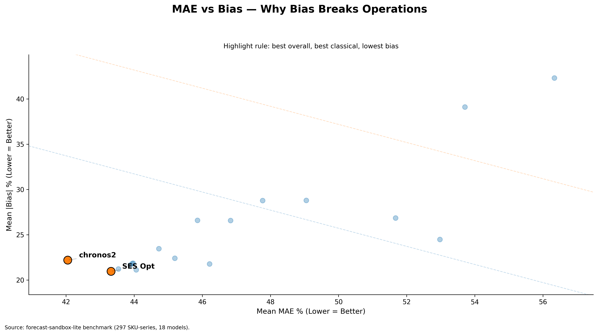
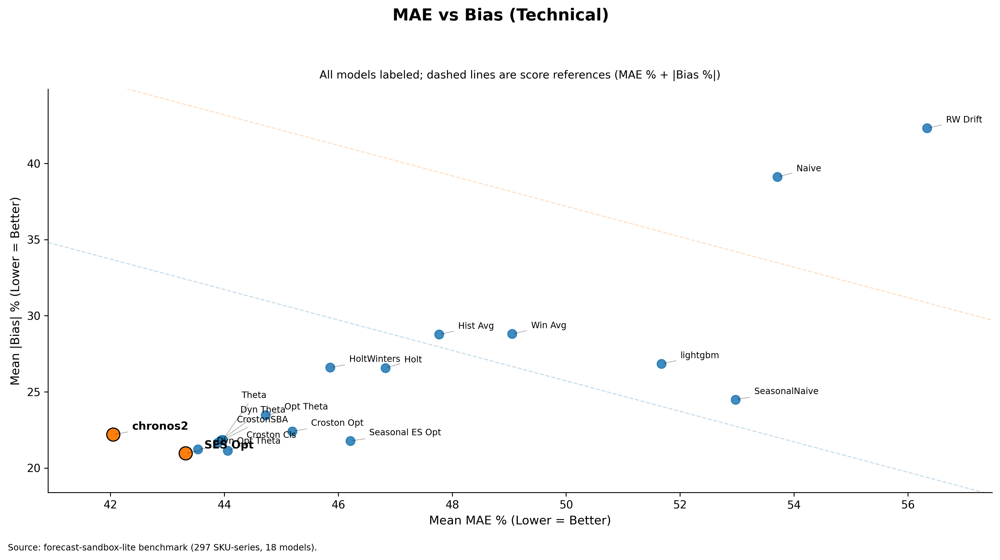

# Your best forecast model might be your biggest operational risk

Forecasts are not made to win benchmarks. They are made for decision-making.

Running a business means dealing with volatility, especially in demand and supply. The better a business can estimate future demand, the better it can plan inventory, negotiate procurement, allocate working capital, and maintain service levels. Better forecasts do not remove uncertainty. They enable better decisions under uncertainty.

Better estimation of demand means that a large chunk of inventory decisions is made far ahead of time. That improves purchasing, product availability, customer satisfaction, and the cost of understocking or overstocking. In that sense, forecasting is not just a modeling problem. It is a business control system.

Due to the inherent volatility of the world, even great forecasts are meaningfully off. Most forecast models are optimized to reduce the gap between forecast and reality without caring about direction. That is what absolute error captures: how far you were from reality, regardless of whether you were too high or too low.

Direction, however, matters over an operational horizon.

That is what **bias** captures: whether a forecasting system consistently leans in one direction over time. A system that consistently over-forecasts creates one kind of operational damage. A system that consistently under-forecasts creates another. In both cases, the damage compounds quietly.

For any given horizon, two numbers define forecast performance:

- **MAE %** — how wrong you are on average, in magnitude
- **Average Bias** — how wrong your system has become, directionally

MAE tells you how wrong you are. Bias tells you how wrong your system has become.

Both metrics are important. But they operate on different timescales and carry different risk profiles. MAE reflects day-to-day noise. Bias reflects directional drift — systematic error. A business can often absorb more day-to-day fluctuation. But bias becomes visible only after the damage is done. A model that is marginally worse on MAE but holds lower bias can still be the stronger operational choice.

The right operating lens is two-dimensional — not a single leaderboard number.

To make this concrete, I benchmarked 18 univariate forecasting models on a 297-SKU subset from **FreshRetailNet-50K**: daily retail data, intermittent demand, perishable operating context.

## Executive view

The executive view makes the tradeoff visible immediately: Chronos2 leads on MAE %, while SES Opt holds lower absolute bias.

Two models ended up very close:

| Model    | MAE % | \|Bias\| % | Composite Score |
|----------|------:|-----------:|----------------:|
| Chronos2 | 42.05 |      22.20 |           64.25 |
| SES Opt  | 43.32 |      20.96 |           64.28 |

This was much more nuanced than a simple Foundation Model (Chronos2) vs Classical Model (SES Opt) story.

Chronos2 leads on MAE % by 1.27 points, or roughly 2.9%.  
SES Opt leads on absolute bias by 1.24 points, which means about 5.6% less directional drift.  
On composite score, they are essentially tied: **64.25 vs 64.28**.

That is the real lesson.

If you optimize only for MAE, you would likely pick Chronos2. But that decision also comes with higher directional drift. Over time, that drift can become slow-motion inventory distortion — the kind that often does not show up in a standard forecasting review until it has already become a business problem.

So the better question is not:

**Which model has the lowest error?**

The better question is:

**Which model gives acceptable error with the least directional risk?**

That question should change model selection.

Operational excellence is not achieved by minimizing forecast error alone. It is achieved by jointly managing error magnitude and directional drift — and by making both visible in the decision process.

A model with slightly better headline accuracy can still be the weaker operational choice if its bias is allowed to accumulate unchecked.

## Technical view

The full benchmark view shows that this is not a cherry-picked comparison. The Chronos2 vs SES Opt tradeoff sits inside a broader portfolio of 18 evaluated models.

That is why the best forecast model on paper can still be your biggest operational risk.
