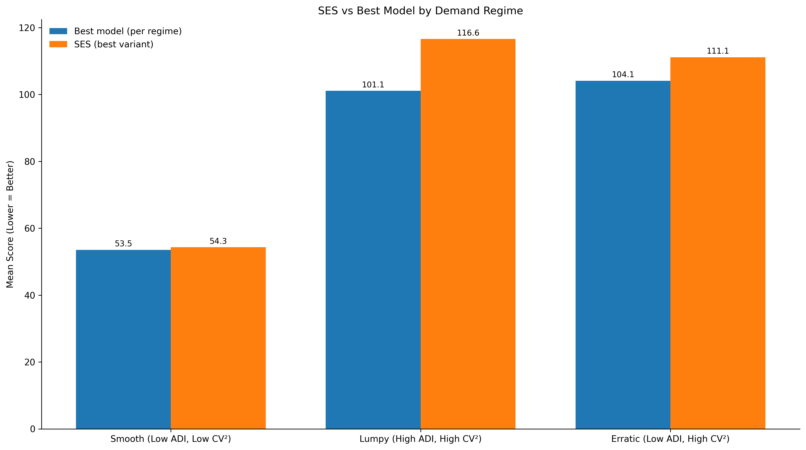

# Simple models remain operationally viable — until demand stops being smooth

*in Notes, Forecasting, Operations · 6 min read*

---

In previous posts, I showed how simple models like SES Optimized are still performant and may give better results than other univariate models. At portfolio level they can perform well. However, choosing a single model without considering demand structure means not capturing the full benefit of these models.

---

## What forecasting models are for

Forecasting models are not made for getting benchmark scores on a portfolio.

They are used to make better decisions for replenishment, purchasing, inventory positioning, working capital allocation, and service-level stability.

Global use of one model is enticing to the practitioner. It reduces complexity. It simplifies explanation. It lowers governance overhead. It makes deployment and maintenance easier.

However, this decision comes with a cost — non-performance across different types of demand.

> A model may look strong at the overall portfolio level and still be a weak default for large parts of it.

---

## Demand is not uniform

Demand patterns are not the same across a portfolio. A portfolio generally contains fundamentally different underlying demand patterns — smooth, erratic, intermittent, and lumpy. Each makes different demands on forecasting models.

A commonly used framework to classify such patterns is the ADI/CV² framework. It checks two things: how frequently demand occurs, and how variable it is when it occurs.

Most portfolios contain all regimes simultaneously. A model that performs well in one regime may not perform well in others. Most forecasting policies do not account for this — they try to minimise the number of models used instead.

SES Optimized is a recency-based model. It performs reasonably well when the underlying signal is stable. In such cases, recent history still carries meaningful information about the near future. The model is simple, efficient, and often surprisingly competitive.

However, if the signal is not inherently stable, recency does not carry as much information about the upcoming future — and performance degrades.

---

## The benchmark

To make this concrete, I benchmarked 18 univariate forecasting models on a 297-SKU subset from FreshRetailNet-50K and grouped SKUs using the ADI/CV² regime lens. Lower score is better.

Above plots the performance of SES Optimized against the best performing model in each regime. The gap is the performance cost of holding SES as the default across that regime.

| Demand regime | Best model score | SES score | Gap  |
|---------------|-----------------|-----------|------|
| Smooth        | 53.5            | 54.3      | 0.8  |
| Erratic       | 104.1           | 111.1     | 7.0  |
| Lumpy         | 101.1           | 116.6     | 15.5 |

*The gap is the performance cost of holding SES as the default across that regime.*

In smooth demand, SES Optimized remains very close to the best performing model. As soon as it moves into erratic and lumpy demand, it is no longer the optimal default.

**What this shows.** Without the regime analysis, one would likely choose SES Optimized as the single operational default — it performs well at portfolio level. The demand-based analysis shows exactly where this model holds and where it fails.

**A note on scope.** These results are specific to this dataset — a daily, perishable, intermittent-demand context. SES being competitive in smooth demand here does not mean it will be competitive in smooth demand on a different dataset, a different category, or a different operating context. The regime lens is the transferable insight. The specific numbers are not.

---

## What this means in practice

| Regime  | Verdict |
|---------|---------|
| Smooth  | SES is defensible here. Governance simplicity earns the marginal accuracy concession. |
| Erratic | SES is no longer optimal. Stronger alternatives are worth evaluating. |
| Lumpy   | SES is not a sound default. The performance cost is too large to absorb. |

Make the model policy as simple as possible — but not simpler than the demand structure allows.

That said, this is not always a day-one decision. Regime-aware model selection requires data infrastructure, classification logic, and governance for multiple model types. That cost is real.

For many organisations, the right first move is still a simple model deployed globally — not because it is optimal across all regimes, but because getting it running cleanly, with proper monitoring and bias tracking, is already a meaningful operational capability. It is the foundation that makes the next step possible.

The regime analysis then becomes the natural next question: now that we have a baseline, where is it costing us? That is a better question to ask from a position of operational stability than from the start of a forecasting programme.

Simple models are not the final destination. But for many teams, they are the right place to begin — and understanding exactly where they hold is what makes the transition to regime-aware policy a deliberate step rather than a reactive one.

---

Model choice should follow demand structure — not hype toward newer models, and not habit toward familiar ones.

That is what separates a model that looks good in a benchmark from a policy that performs well in a real portfolio.

---

*Benchmark: 297 SKUs · FreshRetailNet-50K · 18 univariate models · Daily perishable retail data · ADI/CV² segmentation · Lower score = better forecast accuracy. Regime-level results; individual SKU variance exists within each category.*
