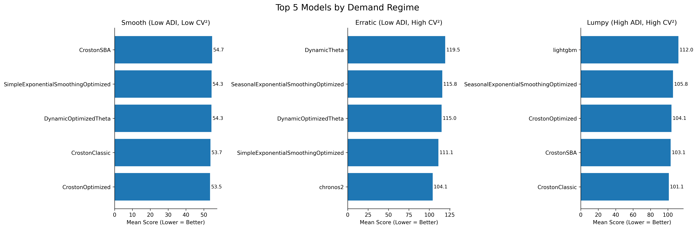

# There is no best forecasting model without a demand regime lens

*in Demand Forecasting, Model-Selection, Operations · 5 min read*

---

A portfolio-level benchmark creates a real temptation. Rank the models, pick the strongest overall performer, and standardise on it. That choice is a good start — it reduces complexity, simplifies explanation, lowers governance overhead, and makes deployment and maintenance easier. In practice, that is often how model policy begins.

Starting there is not an issue. Staying there is.

There are different underlying demand structures in a portfolio and they put different demands on the model being built for it. If a portfolio model is chosen globally, it may end up partially optimised for the demand structure that is most frequently present — and underperform everywhere else.

Take a supermarket that sells everything from daily household needs to high-end computing devices. The margins on day-to-day needs may not be high, but high footfall and sheer volume keeps the operation running. However, it may also be important to focus on products that are luxury and sold infrequently — MacBook Pros, luxury dresses, perfumes etc. Here the market can make higher margins if it is able to plan more appropriately for demand. That is, if the supermarket can supply for demand in such a way that sunk costs are low and demand is met better, the market makes more margins on those products.

In plain terms: forecasting of each product does not carry equal cost, margins, and demand structure. A forecasting portfolio cannot treat all products as equal weights. This is where demand regimes become critical.

> The global ranking compresses different demand structures into one number. It is only when the portfolio is segmented that the cost of that assumption becomes visible.

In the last post, we saw that SES performed nearly as well as the best model in smooth demand — but its performance suffered in other demand types. Once the first model starts performing well, one needs to pivot toward the second set of larger gains — which come from increasing complexity only a little by using models suited to each demand structure. I studied the best performing model per regime to make this concrete.

*Top 5 models per regime — smooth, erratic, lumpy. Lower score is better.*

In smooth demand, CrostonOptimized was the top model with the lowest score. The top five models were neck and neck in competition — the spread between them was small.

As soon as we shift to erratic demand, the best model was Chronos2 — and this time with a wider range of score differences between the top model and the rest.

In lumpy demand, CrostonClassic came out on top.

This underlines the point. The model chosen as the best portfolio model — SES Optimized — was not the top model in any of the demand regimes. It was consistently among the top performing models across regimes, but had significant deviations from the top model in each one. A globally competitive model is not automatically the best choice for the demand structures that matter most operationally.

---

**A note on scope.** These results are specific to this dataset — a daily, perishable, intermittent-demand retail context using 18 univariate models on a 297-SKU subset.

The transferable insight is not that one named model will always win a given regime in every domain. It is that model rankings can change materially once demand structure is separated instead of averaged together.

---

Model choice should follow demand structure — not hype toward newer models, and not habit toward familiar ones. A small tradeoff in complexity can unlock meaningfully better results.

---

*Benchmark: 297 SKUs · FreshRetailNet-50K · 18 univariate models · Daily perishable retail data · ADI/CV² segmentation · Lower score = better forecast accuracy. Regime-level results; individual SKU variance exists within each category.*