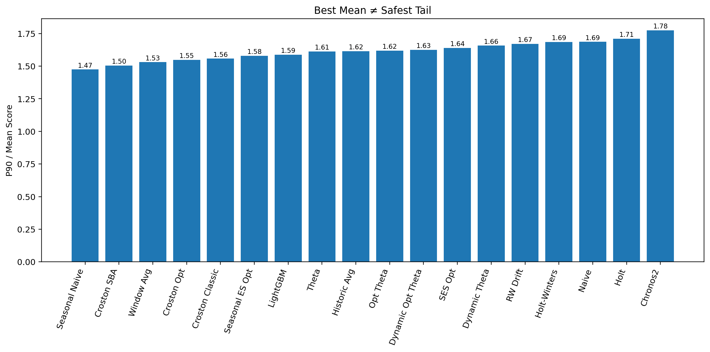

# Averages do not show where the model starts to fail

In the series of posts so far, I have shown you how selecting models for a portfolio is more nuanced than choosing the top model with the lowest mean absolute error. There is one more thing left: robustness.

A model must perform well on average. However, in the cases where it is underperforming, it should not be too much worse. Average scores or metrics hide these details. They are necessary — but they do not tell the complete story.

In my benchmark, Chronos2 had the lowest mean score (MAE% + Bias%) of 64.25, followed by SES Opt at 64.28. On average, they are nearly equal in performance.

When a worse case appears in demand forecasting, the model should not produce results that are too far off. Take a large supermarket as an example. As its operator, you would not want a model that performs well on lower-margin items but fails on higher-margin ones. This is what needs to be checked before deploying a model in production for demand forecasting.

There is a straightforward way to make this visible. Look into percentile performance — specifically the P90 of the score, which shows performance at the bad tail of the portfolio. Then compare it to average performance (mean). Simply calculate P90 / Mean to check how robust a model is relative to others. A lower ratio means the model stays more controlled. A higher ratio means it deteriorates more sharply. This is not a complete framework for risk assessment, but it is a good start.

Average score puts Chronos2 at the top. However, in previous posts I already showed that SES Opt carries lower absolute bias than Chronos2. Now let us add this new layer to the comparison.

| Model    | Mean Score | Bias   | P90 Score | P90 / Mean |
|----------|------------|--------|-----------|------------|
| Chronos2 | 64.25      | 22.20  | 114.07    | 1.78       |
| SES Opt  | 64.28      | 20.96  | 105.36    | 1.64       |

SES Opt now looks more deployable — near-top average performance, lower bias, and more controlled weakening once performance moves into the bad tail.

The plot below shows that Chronos2 has the worst tail behavior among all models benchmarked, while SES Opt is far more stable where it matters.

Tail behavior becomes especially important when:

- Forecast misses are costly
- Planners remember bad cases more than average performance
- Unstable behavior weakens trust in the system
- A default model is expected to remain dependable across the full portfolio

The larger argument is this: average scores do not ensure operational trustworthiness. One needs to combine all metrics — MAE%, Absolute Bias%, MAE% + Absolute Bias%, and P90 / Mean — to arrive at the right decision.

*Note: This article does not argue that average metrics are unnecessary or that there is no need for regime-aware forecasting.*
