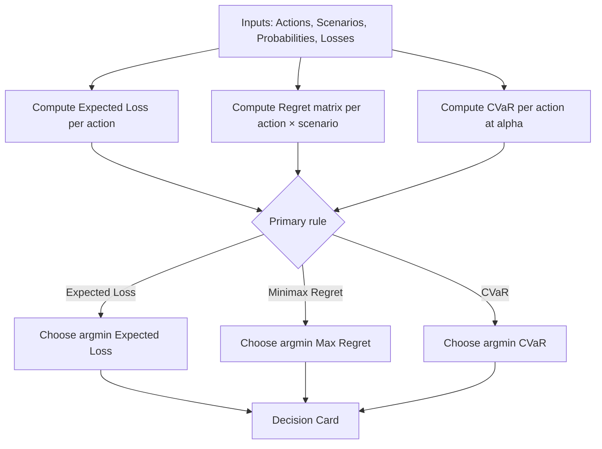

# Decision Kernel Lite — Choosing Under Uncertainty

## Live demo (embedded)

<iframe
  src="https://pranavsharma-decision-kernel-lite.hf.space"
  style="width: 100%; height: 900px; border: 0; border-radius: 12px;"
  loading="lazy"
  allow="clipboard-read; clipboard-write"
></iframe>

- Open in new tab: <https://pranavsharma-decision-kernel-lite.hf.space>
- Hugging Face page: <https://huggingface.co/spaces/PranavSharma/decision-kernel-lite>
- GitHub repo: <https://github.com/Sharma-Pranav/decision-kernel-lite>

---

## What you can do in the demo (30 seconds)

1. Define **Scenarios + Probabilities** (they’ll be normalized if they don’t sum to 1).
2. Define **Actions + Losses** (loss matrix = action × scenario).
3. Choose a decision lens:
   - **Expected Loss**
   - **Minimax Regret**
   - **CVaR** (tail-risk)
4. Copy the generated **Decision Card** (exec-ready rationale).

---

## What this proves

- Decisions fail because uncertainty is handled informally: probabilities are debated, downside is underestimated, and justification is retrospective.
- You don’t need certainty to decide. You need **explicit assumptions**, **bounded downside**, and **defensible trade-offs**.
- Different lenses are not “better/worse” — they represent different risk postures.

---

## Core concept

A decision is defined by four primitives:

**Actions × Scenarios × Probabilities × Losses**

The kernel evaluates each action under three lenses and outputs **one recommended action** + **justifications**.

---

## Decision lenses (when to use what)

### 1) Expected Loss (risk-neutral)

Use when:

- decisions repeat frequently
- probabilities are reasonably trusted
- variance is acceptable

Optimizes:

- **long-run average pain**

### 2) Minimax Regret (robust / political safety)

Use when:

- probabilities are unreliable or contested
- it’s one-shot or high-accountability
- post-hoc defensibility matters

Optimizes:

- **“what will I regret least in hindsight?”**

### 3) CVaR (tail-risk protection)

Use when:

- rare bad outcomes are unacceptable (ruin / safety / bankruptcy)
- downside is asymmetric and must be bounded
- survival > average performance

Optimizes:

- **average loss in the worst cases** (tail), not the overall average

---

## Decision logic (high level)

---

## Rule recommendation (simple heuristic)

The app includes a transparent heuristic:

- if **tail risk dominates average risk** → recommend **CVaR**
- otherwise → recommend **Expected Loss**

This is advisory only; you can override it. Governance is preserved.

---

## Outputs you get

- **One recommended action**
- Evidence table with:

  - Expected Loss
  - Max Regret
  - CVaR@alpha
- Regret table (action × scenario)
- A copy/paste **Decision Card** (for a memo or exec deck)

---

## Downloads

!!! info "Slides"

- [Direct download (PPTX)](https://raw.githubusercontent.com/Sharma-Pranav/decision-kernel-lite/main/Decision_Kernel_Lite__Choosing_Under_Uncertainty.pptx)
- [View on GitHub](https://github.com/Sharma-Pranav/decision-kernel-lite/blob/main/Decision_Kernel_Lite__Choosing_Under_Uncertainty.pptx)

---
